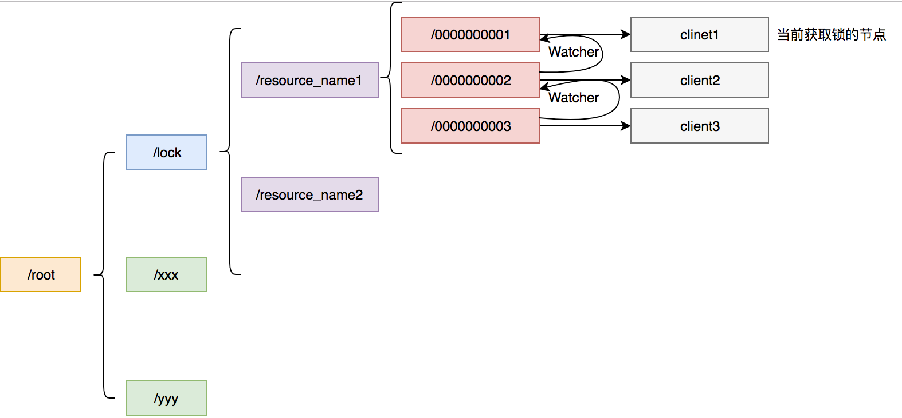
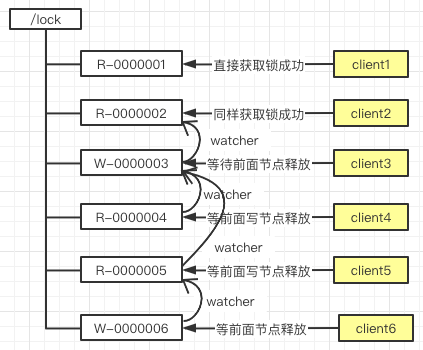

## 分布式锁实现
定义：为什么使用锁？锁的出现是为了解决资源争用问题，在单线程环境下的资源争夺可以使用JDK里的锁实现，
分布式锁是为了解决分布式环境下的资源争用问题。

### 基于zookeeper实现
#### 1.排它锁
简介：排他锁(Exclusive Locks，简称X锁)，又称为写锁或独占锁，是一种基本的锁类型。
如果事务 T1对数据对象 O1加上了排他锁，那么在整个加锁期间，只允许事务 T1对 O1进行读取和更新操作，其他任何事务都不能再对这个数据对象进行任何类型的操作——直到T1释放了排他锁。（相当于悲观锁）

###### 实现逻辑：
（1）定义锁：<BR>
zookeeper上的节点来表示一个锁，例如/exclusive_lock/lock节点就可以被定义为一个锁  
注意：这里需要创建的是临时节点，是为了避免死锁，当服务宕机会话关闭临时节点将会被删除，锁自动释放

（2）获取锁：<BR>
在需要获取锁时，所有的客户端都会试图通过调用 create()接口，在/exclusive_lock节点下创建临时子节点/exclusive_lock/lock。在前⾯，我们也介绍了，
ZooKeeper 会保证在所有的客户端中，最终只有⼀个客户端能够创建成功，那么就可以认为该客户端获取了锁。
同时，所有没有获取到锁的客户端就需要到/exclusive_lock 节点上注册⼀个子节点变更的Watcher监听，以便实时监听到lock节点的变更情况。
+ 1）尝试获取锁，尝试创建临时节点，zk会保证只有一个客户端创建成功
+ 2）如果创建节点成功则获取锁成功，继续执行业务逻辑
+ 3）如果创建节点失败，节点已经被其他客户端创建，则获取锁失败，监听该节点的删除事件，这期间线程出于阻塞等待状态
+ 4）第2步的线程执行完业务逻辑，释放锁，即删除节点，监听该节点的线程会收到通知，退出等待，可以再次尝试获取锁，递归第1步，递归：获取锁的过程是一个递归的操作，获取锁->监听->获取锁

（3）释放锁：  
有两种情况可以释放锁：
1. 当前获取锁的客户端机器发生宕机，那么ZooKeeper上的这个临时节点就会被移除。
2. 正常执行完业务逻辑后，客户端就会主动将⾃⼰创建的临时节点删除。 无论在什么情况下移除了lock节点，
ZooKeeper都会通知所有在/exclusive_lock节点上注册了子节点变更Watcher监听的客户端。这些客户端在接收到通知后，再次重新发起分布式锁获取，即重复“获取锁”过程。

实现参考类：cn.yao.lock.zk.mutex.ZkLockMutex

优点：实现简单  
缺点：
+ 不可重入，所谓的重入是递归获取锁，当已经持有锁时再尝试获取锁时，不可重入锁会产生死锁等待
+ 有羊群效应，当释放锁的时候会把其他所有机器全部唤醒，但是最终只有一台机器会抢到锁，没有抢到的还得继续休眠。
+ 非公平锁，每次都需要重新排队，而不是按FIFO队列获取锁


#### 2. 排他锁升级
优化目的：解决羊群效应，同时保证公平锁

实现原理：区别是创建的临时顺序节点，每一个客户端在争夺锁时都会由zk分配一个顺序号(sequence)，客户端按照这个顺序去获取锁
```
basePath/
    ├──lock-0000000000（由client1创建，由于序号最小，所以获取到锁）
    ├──lock-0000000001（由client2创建，并监听lock-0000000000的变化）
    └──lock-0000000002（由client3创建，并监听lock-0000000001的变化）
```


具体流程：  
获取锁：  
1. 客户端尝试获取锁，客户端创建临时顺序节点/distribute-lock2/lock-，返回/distribute-lock2/lock-0000000001
2. 拿到sequence，获取节点/distribute-lock2下所有子节点，并排序
3. 如果没有比自己小的节点，则获取锁成功
4. 如果存在比自己小的节点，则监听上一个比自己小的节点的删除事件，监听期间，线程等待，一旦监听到上一个节点被删除，线程被唤醒，再次尝试获取锁(直接拿到锁即可)
    
释放锁： 同其他逻辑一样，删除当前节点即可

参考实现类：cn.yao.lock.zk.mutex.ZkLockMutexUpgrade


#### 可重入排它锁
目标：实现可重入(当前线程再次获取锁时成功而不是死锁)，同时避免羊群效应
例如：
```
methodA(){
    lock1.lock();
    //doSomething....
    methodB();
    lock1.unlock();
}

methodB(){
    lock2.lock();
    //doSomethind....
    lock2.unlock();
}

// 如果是不可重入锁，methodA在调用methodB方法时需要再次获取锁lock2.lock(),此时因为锁没有释放，会阻塞等待
// 导致结果死锁产生
// 解决办法：锁可重入，对于同一线程，可以再次获取锁
```

**实现原理：**  
可重入锁需要维护每次锁的线程信息，每当有获取锁请求时先判断请求线程是不是已经拿到了锁如果已经拿到了锁直接返回获取锁成功，否则进入阻塞等待状态

**实现步骤：**  
前提：需要全局保存获取到锁的线程Thread和重入的次数reetrantCount  
获取锁：  
1. 请求获取锁，先判断当前reetrantCount是否等于0，如果为0，表示没有线程获取锁，则去抢占锁，抢占锁逻辑同上面排他锁，创建一个临时顺序节点
2. 如果大于0，则表示已经有锁存在，则判断拿到锁的线程是不是当前请求的线程，如果是当前请求线程则直接获取锁，reentrantCount+1
3. 如果第2步判断拿到锁的线程不是当前线程，则当前线程进入阻塞等待(走的也是抢占锁逻辑)

释放锁：  
1. 获取到当前线程是不是拿到锁的线程，如果是reentrantCount--
2. 再判断reentrantCount是否为0，如果是，删除锁对应的节点

参考代码：cn.yao.lock.zk.mutex.ZkLockReentantMutex

#### 读写锁
简介：读写锁是同一时刻可以允许多个读操作访问，但是在写操作访问时，所有的后续读操作和其他写操作均会被阻塞,目标是减小锁的阻塞范围。juc提供的读写锁实现是ReentantReadWriteLock。

**实现：**
定义锁：和排他锁一样，同样是通过zk上的数据节点来表示一个锁,是类似一个/lock/请求类型-序号的临时顺序节点，例如：/lock/R-000001表示一个读锁节点



获取锁：  
1. 创建一个临时顺序节点，如果当前是读请求，那就就创建如/lock/R-的节点，如果是写请求，就创建/lock/W-的节点
2. 创建完节点之后，获取父路径/lock节点下所有子节点，
    + 如果是读请求，判断比自己小的节点是否存在写节点,如果存在写节点，进入阻塞等待，并监听此节点，如果没有写节点，则获取锁成功，开始执行业务逻辑
    + 如果是写请求，判断当前是否是最小节点，如果是获取锁成功，如果不是，进入阻塞等待，监听上一个比自己小的节点
   
参考代码：cn.yao.lock.zk.mutex.ZkLockReadWrite
    
#### 开源实现-Curator分布式锁工具
Curator实现了可重入锁(InterProcessMutex),也实现了不可重入锁(InterProcessSemaphoreMutex)。在可重入锁中还实现了读写锁
代码示例：
```
//通过下面一段代码实现可重入锁
InterProcessMutex lock = new InterProcessMutex(client, lockPath);
try {
    lock.acquire();
    //doSomething 业务员逻辑
} finally{
    lock.release();
}
```


### 基于redis实现分布式锁


### 总结
+ 实现方式不同：redis实现为去插入一条占位数据，而zk实现为注册一个临时节点
+ 遇到宕机情况下，redis需要等到过期时间到了后自动释放锁，而ZK因为是临时节点，在宕机时候已经是删除了节点去释放锁
+ redis在没抢到锁的情况下一般会去自旋获取锁，比较浪费性能，而ZK是通过注册监听的方式获取锁，性能而言优于Redis